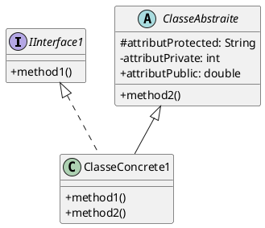
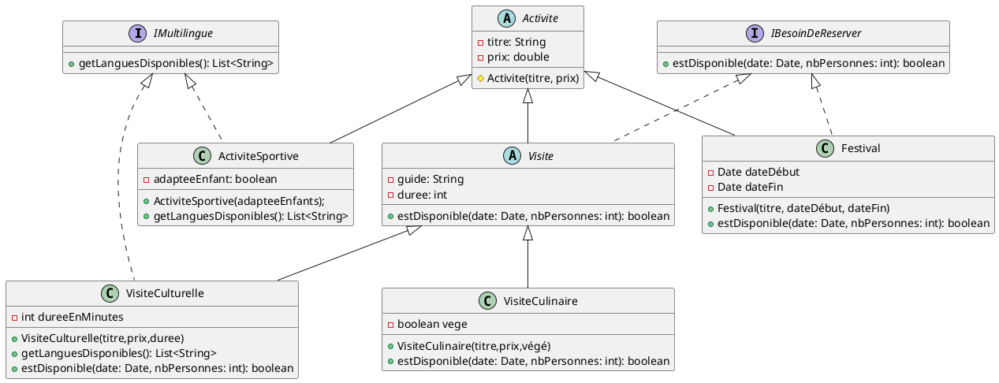

Vous débutez un stage chez l'entreprise GetYourGuide qui propose des activités touristiques. On vous demande de concevoir un système permettant de gérer un ensemble d’activités touristiques réservables.

Malheureusement, la réunion de lancement à eu lieu avant votre arrivée et vous n'avez que les notes de la réunion pour implémenter votre POC. 


Voici les notes de la réunion, elles ne sont pas synthétisées, alors prennez le temps de bien lire l'énnoncé avant de vous lancer. 

> - Toutes les activités ont un prix et un titre.  
> - Il y a des visites avec un guide. Ces visites peuvent être culinaires ou > culturelles.  
> - Il existe également des activités sportives.  
> - Les activités sportives et activités culturelles peuvent être proposées dans > différentes langues.  
> - Il existe aussi des festivals.  
> - Les activités avec un guide ont toujours une durée et doivent être réservées.  
> - Les activités qui peuvent être réservées sont disponibles ou non pour une date et un > nombre de personnes donné.  
> - Les visites culinaires sont adaptées ou non aux végétariens
> - Les activités sportives sont ou non adaptées aux enfants. 
> - Pour un festival il y a toujours une date de début et de fin, l'entrée est gratuite > et il y a un nombre de place illimités par contre il faut bien réserver.
> - Les visites culturelles ont toutes une durée exprimée en minutes


## 1. Présentez un diagramme UML de la solution (4pts)
_Faites bien attention au sens des flêches, à respecter les implémentations d'interfaces et les héritages de classe._
_Aussi, pensez bien à représenter les constructeurs, les méthodes et leurs modificateurs de visibilité_



## 2. Implémentez les méthodes manquantes (4pts)

Soit le code suivant : 

```java


public class Utilisateur {
    public final UUID id;
    public final List<Reservation> reservations;
    private String langue;

    public Utilisateur(String langue) {
        this.id = UUID.randomUUID();
        this.activitesReservees = new ArrayList<>();
        this.langue = langue;
    }

    public String getLangue() {
        return langue;
    }

    public void setLangue(String langue) {
        this.langue = langue;
    }

}
public class Reservation {
    public final UUID userId;
    public final Activite activite;
    public final Date date;
    public final int nbPersonnes;
    Reservation(int userId, Activite a, Date d, int n){
        activite = a; 
        date = d;
        nbPersonnes = n;
    }
    Reservation(Utilisateur u, Activite a, Date d, int n){
        this(u.id,a,d,n)
    }
}
public class BookingService {


    public boolean estDisponible(??? param1, Date date, int nbPersonnes) {
        // TODO : Implémentez la méthode
    }

    // Tente de réserver l'activité pour l'utilisateur
    public void reserverActivite(Utilisateur utilisateur, ??? param1, Date date, int nbPersonnes) throws Exception {
        if(!estDisponible(param1,date,nbPersonnes)){
            throw new Exception("Il n'y a plus de place disponnible pour cette activité")
        }
        var booking = new Reservation(utilisateur,???,date,nbPersonnes);
        utilisateur.reservations.add(booking);
        sendConfirm(booking);
    }

    private sendConfirm(Booking booking){
        // Imaginez que cette méthode envoie une confirmation par email
        // On ne vous demande pas de la coder
    }


    // Vérifie si l'activité correspond à la langue de l'utilisateur
    public boolean estCompatibleLangue(Utilisateur utilisateur, ??? param1) {
        // TODO : Implémentez la méthode
    }
}

```


## 3. Reflexions sur l'implémentation (2 pts par questions)

1. Le champ id de la classe Utilisateur est déclaré public final.
    - Quels avantages cela peut-il avoir dans ce contexte ?
    - Devrait-on encapsuler ce champ ? Pourquoi ou pourquoi pas ?  

2. Dans BookingService, proposez un ou deux _design patterns_ de votre choix afin d'améliorer la solution.   
Justifiez en précisant ce que cela apporterait en termes de fonctionnalités ou de maintenance.

3. L'équipe décide de mettre en place **Get Your Guide _Premium Plus_**
- Ils bénéficient de 15 % de réduction sur toutes les activités réservables.
- Pour les activités sportives, culturelles et culinaires ils reçoivent un avantage exclusif (ex. : accès en coulisses, goodies…).

Comment implémenteriez-vous cette fonctionnalité en modifiant le moins possible votre code ?

## Questions Bonus

4. Quelle est la différence entre une **interface** et une **classe abstraite** en Java ? Donnez des cas d’usage concrets où vous utiliseriez l’un plutôt que l’autre.

5. Soit le code suivant :

```java
public class Boussole {
    private String direction;

    public Boussole(String direction) {
        this.direction = direction;
    }

    public void tournerVers(String nouvelleDirection) {
        this.direction = nouvelleDirection;
    }
}
```

Expliquez pourquoi l’utilisation d’une **énumération (`enum`)** serait préférable ici, et réécrivez le code avec `enum`.


---

# Corrigé

## Exercice 1




## Exercice 2

```java 

public boolean estDisponible(IBesoinDeReserver activite, Date date, int nbPersonnes) {
    return activite.estDisponible(date, nbPersonnes);
}

// Tente de réserver l'activité pour l'utilisateur
public void reserverActivite(Utilisateur utilisateur, IBesoinDeReserver activite, Date date, int nbPersonnes) throws Exception {
    if (!estDisponible(activite, date, nbPersonnes)) {
        throw new Exception("Il n'y a plus de places disponibles pour cette activité.");
    }
    Reservation booking = new Reservation(utilisateur, (Activite) activite, date, nbPersonnes);
    utilisateur.ajouterReservation(booking);
    sendConfirm(booking);
}

private void sendConfirm(Reservation booking) {
//
}

// Vérifie si l'activité correspond à la langue de l'utilisateur
public boolean estCompatibleLangue(Utilisateur utilisateur, Activite activite) {
    if (activite instanceof IMultilingue multi) {
        return multi.getLanguesDisponibles().contains(utilisateur.getLangue());
    }
    // Si ce n'est pas une activité multilingue, on considère qu'elle est compatible
    return true;
}


```

1. Le paramètre ??? est remplacé par IBesoinDeReserver là où on a besoin d’une activité réservable (estDisponible et reserverActivite). (ou utiliser instanceof)
2. Il faut bien penser à caster IBesoinDeReserver en Activite ou inversement selon qu'on ait  utilisé instanceof à la première question 
3. Montrer la maitrise de instanceof pour le _estCompatibleLangue_


# Exercice 3 

1. Le champ id de la classe Utilisateur est déclaré public final
- Avantages dans ce contexte :

    -   Immuabilité : une fois l’ID assigné (via UUID.randomUUID()), il ne peut plus être modifié, ce qui garantit l'identité unique et constante de l'utilisateur dans le système.
    -   Lisibilité directe : en étant public, l’accès à l’identifiant est simple et immédiat, sans méthode d’accesseur (getter), ce qui peut être suffisant dans un petit projet ou une phase de prototypage.
- Inconvénient / Encapsulation :

    - Rupture de l'encapsulation : exposer directement un champ viole un principe fondamental de la POO. Même si le champ est final, on ne peut pas interdire totalement les modifications d’un objet mutable exposé (ex. : une liste).
    -   Évolutivité limitée : si un jour on souhaite changer la manière dont l'ID est généré, ou faire des traitements lors de l’accès, on ne pourra pas le faire sans casser le code existant.

Mieux vaut le rendre private final et fournir un getter public (getId()). Cela respecte le principe d'encapsulation tout en garantissant l’immutabilité.

2. Design Patterns pour améliorer BookingService
- Strategy Pattern – Pour la tarification, ou pour l'envoi de la confirmation
- Factory Method ou Abstract Factory – Pour la création de réservations
- Observer - Pour envoyer une notif à celles et ceux ayant l'appli 
- Singleton pour le service
- Command pour les actions (annuler, réserver, etc)


3. 
Pour le groupe Dev je veux qu'ils fassent une stratégie, pour les autres un boolean "estPremium" convient mais au moins qu'ils rajoutent tous une interface.

### Groupe Dev

```plantuml 

class Utilisateur {
    + UUID id
    + List<Reservation> reservations
    - String langue
    - ITarificationStrategy strategy
}
interface ITarificationStrategy {
    + double calculerPrix(Activite a, Utilisateur u)
}

Utilisateur *-- ITarificationStrategy

class TarificationStandard implements ITarificationStrategy
class TarificationPremiumPlus implements ITarificationStrategy

interface IAvantagePremium {
    + String getAvantage()
}

interface IMultilingue {
    +getLanguesDisponibles(): List<String>
}

interface IBesoinDeReserver {
    +estDisponible(date: Date, nbPersonnes: int): boolean
}

abstract class Activite {
    # Activite(titre, prix)
    -titre: String
    -prix: double
}

class ActiviteSportive extends Activite implements IMultilingue, IAvantagePremium  {
    -adapteeEnfant: boolean
    + ActiviteSportive(adapteeEnfants);
    +getLanguesDisponibles(): List<String>
    + String getAvantage()
}


abstract class Visite extends Activite implements IBesoinDeReserver, IAvantagePremium {
    -guide: String
    -duree: int
    # String getAvantage()
    +estDisponible(date: Date, nbPersonnes: int): boolean
}

class VisiteCulinaire extends Visite {
    - boolean vege
    +VisiteCulinaire(titre,prix,végé)
    +estDisponible(date: Date, nbPersonnes: int): boolean
    + String getAvantage()
}

class VisiteCulturelle extends Visite implements IMultilingue {
    - int dureeEnMinutes
    +VisiteCulturelle(titre,prix,duree)
    +getLanguesDisponibles(): List<String>
    +estDisponible(date: Date, nbPersonnes: int): boolean
    + String getAvantage()
}

class Festival extends Activite implements IBesoinDeReserver {
    - Date dateDébut
    - Date dateFin
    + Festival(titre, dateDébut, dateFin)
    +estDisponible(date: Date, nbPersonnes: int): boolean
}

@enduml

```


### Groupe réseau


**But** : Permettre aux utilisateurs **Premium Plus** de bénéficier d’une réduction de 15 % et d’avantages exclusifs pour certaines activités (sportives, culturelles, culinaires).

Voici la manière de l'implémenter en modifiant le moins possible le code, en ajoutant juste un attribut `premiumPlus` à la classe `Utilisateur` :

### Étapes d'implémentation :

1. **Ajout de l'attribut `premiumPlus` dans la classe `Utilisateur`** :

   * Ajoutez un boolean `premiumPlus` pour indiquer si l'utilisateur bénéficie de l'abonnement Premium Plus.

   ```java
   public class Utilisateur {
       public final UUID id;
       public final List<Reservation> reservations;
       private String langue;
       private boolean premiumPlus;  // Nouveau champ

       public Utilisateur(String langue, boolean premiumPlus) {
           this.id = UUID.randomUUID();
           this.reservations = new ArrayList<>();
           this.langue = langue;
           this.premiumPlus = premiumPlus;
       }

       public boolean isPremiumPlus() {
           return premiumPlus;
       }

       public void setPremiumPlus(boolean premiumPlus) {
           this.premiumPlus = premiumPlus;
       }
   }
   ```

2. **Modification dans `BookingService`** :

   * **Réduction de 15 %** : Avant de finaliser une réservation, vérifiez si l'utilisateur est Premium Plus. Si c'est le cas, appliquez la réduction de 15 % sur le prix de l'activité réservée.
   * **Avantages exclusifs** : Pour les activités sportives, culturelles ou culinaires, si l'utilisateur est Premium Plus, affichez ou ajoutez un avantage exclusif (par exemple, "Accès en coulisses" ou "Goodies").

   Modifiez le calcul du prix et l'envoi de l'avantage exclusif comme suit :

   ```java
   public class BookingService {

       // Méthode pour calculer le prix de l'activité
       public double calculerPrix(Activite activite, Utilisateur utilisateur) {
           double prixFinal = activite.getPrix();
           if (utilisateur.isPremiumPlus()) {
               prixFinal *= 0.85;  // Applique 15 % de réduction
           }
           return prixFinal;
       }

       // Méthode pour réserver l'activité
       public void reserverActivite(Utilisateur utilisateur, Activite activite, Date date, int nbPersonnes) throws Exception {
           if (!estDisponible(activite, date, nbPersonnes)) {
               throw new Exception("Il n'y a plus de place disponible pour cette activité.");
           }

           double prix = calculerPrix(activite, utilisateur); // Calcul du prix avec ou sans réduction
           var booking = new Reservation(utilisateur, activite, date, nbPersonnes);
           utilisateur.reservations.add(booking);
           sendConfirm(booking);

           if (utilisateur.isPremiumPlus() && (activite instanceof Sportive || activite instanceof Culturelle || activite instanceof Culinaire)) {
               // Ajoute un avantage exclusif pour les activités sportives, culturelles et culinaires
               System.out.println("Avantage exclusif pour cet utilisateur Premium Plus : Accès en coulisses ou goodies !");
           }
       }

       private void sendConfirm(Reservation booking) {
           // Envoie de la confirmation par email (logique non implémentée ici)
       }
   }
   ```

3. **Test de la fonctionnalité** :

   * Lors de la création d’un utilisateur Premium Plus, la réduction de 15 % doit être appliquée.
   * Lors de la réservation d'activités sportives, culturelles ou culinaires, un message ou un avantage exclusif doit être ajouté si l’utilisateur est Premium Plus.

---

### Explication des choix :

* **Modification minimale** : Nous avons seulement ajouté un champ `premiumPlus` dans la classe `Utilisateur`, et la logique d’application de réduction et d’avantage exclusif a été implémentée dans `BookingService` sans toucher aux autres classes de l’application.
* **Simplicité** : Le code reste simple et ne nécessite pas l’introduction de patterns complexes. Un simple `boolean` suffit à distinguer les utilisateurs Premium Plus et appliquer la réduction.
* **Évolutivité** : Si la fonctionnalité devait devenir plus complexe à l'avenir (par exemple, des réductions différentes pour des types d’activités spécifiques), cela serait facilement modifiable tout en conservant cette approche simple.
