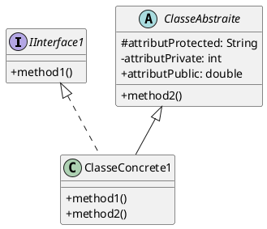
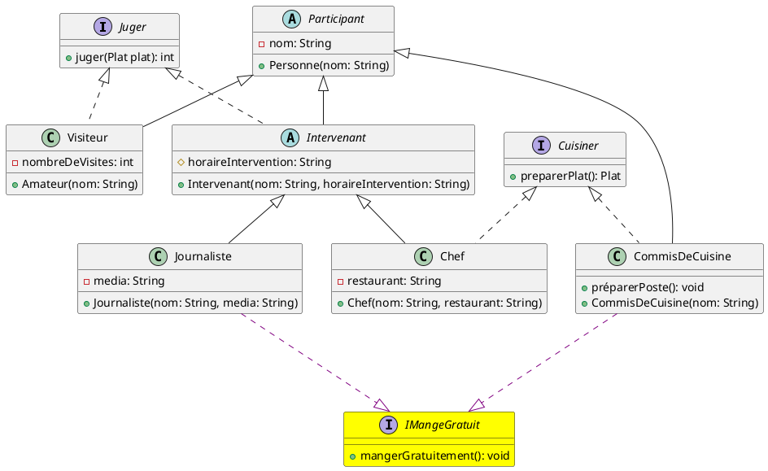

# Partie 2 - 14 pts

Vous débutez un stage dans une entreprise qui organise des festivals culinaires. On vous demande de concevoir un système permettant de gérer les participants.

Malheureusement, la réunion de lancement a eu lieu avant votre arrivée et vous n'avez que les notes de la réunion pour implémenter votre POC.

Voici les notes de la réunion, elles ne sont pas synthétisées, alors prenez le temps de bien lire l'énoncé avant de vous lancer.

> - L'application gère des participants à des événements culinaires, il n'est pas nécessaire de gérer les événements eux-mêmes.
> - Tous les **participants** ont un **nom**.
> - Les **visiteurs** sont des _participants_ qui peuvent **juger** des plats, ils ont un **nombre de visites effectuées**.
> - Il y a les **intervenants**, qui sont des _participants_ qui peuvent aussi **juger** des plats, un intervenant est un professionnel qui vient sur le festival pour son travail, ils ont un **horaire d'intervention** et peuvent être de deux types :
>   - Les **chefs** sont des _intervenants_ qui peuvent **cuisiner** des plats, ils ont un **restaurant**.
>   - Les **journalistes** sont des _intervenants_ et ils ont un **média**.
> - Un dernier type de _participant_ est le **commis de cuisine**, qui peut aussi **cuisiner** des plats, mais il n'est pas un intervenant, il est là pour aider les chefs.

---

## 1. Présentez un diagramme UML de la solution (4pts)

_Faites bien attention au sens des flèches, à respecter les implémentations d'interfaces et les héritages de classe._
_Aussi, pensez bien à représenter les constructeurs, les méthodes et leurs modificateurs de visibilité_



## 2. Réflexions sur l'implémentation (2 pts par question)

Voici le code de la classe `Participant`.

```java

public class Participant {
    public String nom;
    public final UUID numeroBadgeRFID;
    public Participant(String nom) {
        this.nom = nom;
        this.numeroBadgeRFID = [...];
    }
    // Autres méthodes et attributs...
}

```

1. Le champ `numeroBadgeRFID` de la classe `Participant` est déclaré `public final`.
   - Quels avantages cela peut-il avoir dans ce contexte ?
   - Devrait-on ajouter un _accesseur_ pour ce champ ? Pourquoi ou pourquoi pas ?
   - Devrait-on ajouter un _mutateur_ pour ce champ ? Pourquoi ou pourquoi pas ?

2. L'équipe de développement souhaite ajouter des fonctionnalités supplémentaires à la gestion des participants :
   - **Repas gratuits** : les journalistes et les commis de cuisine peuvent manger gratuitement.
   - **Plurilinguisme** : les chefs et les commis de cuisine doivent pouvoir indiquer leur langue de travail afin de faciliter la préparation des plats.
   - **Spécialisation culinaire** : les journalistes et les chefs doivent pouvoir indiquer leur spécialisation culinaire (par exemple, pâtisserie, cuisine italienne, etc.).

   Comment implémenteriez-vous ces fonctionnalités en modifiant le moins possible votre code ?

3. Dans une autre classe, on souhaite coder une méthode qui permet à un participant de juger un plat ; la méthode prend en paramètre un participant et un plat, et retourne un entier représentant la note donnée au plat.  
   Donnez un exemple de code pour cette méthode. (Souvenez-vous que tous les participants ne peuvent pas juger de plats)

## 3. Questions de cours (2 pts par question)

4. Quelle est la différence entre une **interface** et une **classe abstraite** en Java ? Donnez des cas d’usage concrets où vous utiliseriez l’une plutôt que l’autre et en quoi cela influencerait la conception de votre système.

5. Soit le code suivant :

```java
public class FeuTricolore {
    private String couleur;

    public FeuTricolore(String couleur) {
        this.couleur = couleur;
    }

    public void changerCouleur(String nouvelleCouleur) {
        this.couleur = nouvelleCouleur;
    }
}
```

Expliquez pourquoi l’utilisation d’une **énumération (`enum`)** serait préférable ici, et réécrivez le code avec `enum`.

---

<!-- pagebreak -->

# Correction

## Question 1



## Question 2

- **Avantages du champ `public final`** :
  - Le mot-clé `final` garantit que la valeur de `numeroBadgeRFID` ne pourra pas être modifiée après l'initialisation dansle constructeur, ce qui est important pour un identifiant unique.
  - Le fait qu'il soit `public` permet un accès direct, ce qui peut simplifier l'accès à cet identifiant dans le code.
- **Ajouter un accesseur ?**
  - Ce n'est pas strictement nécessaire car le champ est déjà accessible publiquement. Cependant, il est recommandéd'utiliser un accesseur (`getNumeroBadgeRFID()`) pour respecter l'encapsulation et permettre de modifierl'implémentation interne sans impacter le reste du code. Toutefois, comme il s'agit d'un UUID, il n'y a pas trop de raisons de l'altérer.
- **Ajouter un mutateur ?**
  - Non, il ne faut pas ajouter de mutateur (`setNumeroBadgeRFID`) car le champ est `final` et ne doit pas être modifié après l'initialisation. Cela garantit l'intégrité de l'identifiant du participant.

Pour implémenter ces fonctionnalités tout en minimisant les modifications du code existant, il est pertinent d'utiliser des interfaces :

- **Repas gratuits** : Créez une interface `IMangeGratuit` avec une méthode `mangerGratuitement()`. Les classes `Journaliste` et `CommisDeCuisine` implémenteront cette interface, car ce sont les seuls types de participants concernés.
- **Plurilinguisme** : Créez une interface `IPlurilingue` avec des méthodes comme `getLangueTravail()` et `setLangueTravail(String langue)`. Les classes `Chef` et `CommisDeCuisine` implémenteront cette interface.
- **Spécialisation culinaire** : Créez une interface `ISpecialisationCulinaire` avec des méthodes comme `getSpecialisation()` et `setSpecialisation(String specialisation)`. Les classes `Chef` et `Journaliste` implémenteront cette interface.

Ainsi, chaque fonctionnalité additionnelle est isolée dans une interface, ce qui évite de modifier la hiérarchie principale des classes et respecte le principe de séparation des responsabilités.

Voici le code modifié pour permettre de juger un plat :

```java
public int jugerPlat(Participant participant, Plat plat) {
    if (participant instanceof Juger) {
        return ((Juger) participant).juger(plat);
    }
    throw new IllegalArgumentException("Ce participant ne peut pas juger de plat.");
}
```

## Question 3

4. **Différence entre une interface et une classe abstraite** :
   - **Interface** :
     - Ne peut contenir que des méthodes abstraites (Java 8 et versions ultérieures permettent les méthodes par défaut).
     - Ne peut pas avoir d'attributs d'instance (seulement des constantes).
     - Permet l'implémentation multiple, c'est-à-dire qu'une classe peut implémenter plusieurs interfaces.
     - Utilisée pour définir un contrat que les classes doivent respecter.
   - **Classe abstraite** :
     - Peut contenir des méthodes abstraites et des méthodes concrètes.
     - Peut avoir des attributs d'instance.
     - Une classe ne peut hériter que d'une seule classe abstraite, ce qui limite l'héritage multiple.
     - Utilisée pour partager du code commun entre les classes dérivées.

   **Cas d’usage** :
   - Utiliser une interface lorsque vous souhaitez définir un comportement que plusieurs classes peuvent partager sans imposer une hiérarchie spécifique (par exemple, `Serializable`).
   - Utiliser une classe abstraite lorsque vous avez une base commune avec des implémentations partagées (par exemple, une classe `Animal` avec des méthodes communes comme `manger()`).

5. **Utilisation d'une énumération (`enum`)** :
   - L'utilisation d'une énumération permet de restreindre les valeurs possibles de `couleur` à un ensemble prédéfini, ce qui améliore la sécurité du type et la lisibilité du code.
   - Cela permet également d'éviter les erreurs de saisie et de garantir que seules les couleurs valides sont utilisées.

```java
public enum CouleurFeu {
    ROUGE, VERT, ORANGE
}
public class FeuTricolore {
    private CouleurFeu couleur;

    public FeuTricolore(CouleurFeu couleur) {
        this.couleur = couleur;
    }

    public void changerCouleur(CouleurFeu nouvelleCouleur) {
        this.couleur = nouvelleCouleur;
    }
}
```
