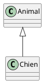

# Système de génération d'examens r/exams

Ce système permet de générer des examens multi-format à partir d'un fichier Rmd "master" unique.

## Syntaxe des questions

### Structure d'une question

Les questions sont séparées par `---` sur une ligne seule.

```markdown
---

:::question
id: identifiant-unique
type: essay|schoice|mchoice|num|string|cloze
title: Titre de la question
points: 3
section: Nom de la section
shuffle: true|false
tolerance: 0.1
solution: valeur

Texte de la question sur plusieurs lignes.

Code, diagrammes PlantUML, etc.

:::answers
- [x] Réponse correcte
- [ ] Réponse incorrecte
- [ ] Autre réponse

:::solution
Explication de la solution...

---
```

### Types de questions

| Type | Description | Champs requis |
|------|-------------|---------------|
| `essay` | Question ouverte | - |
| `schoice` | Choix unique | `:::answers` |
| `mchoice` | Choix multiple | `:::answers` |
| `num` | Réponse numérique | `solution`, `tolerance` (optionnel) |
| `string` | Réponse texte | `solution` |
| `cloze` | Texte à trous | Syntaxe spéciale dans le texte |

### Métadonnées disponibles

| Champ | Description | Défaut |
|-------|-------------|--------|
| `id` | Identifiant unique | Auto-généré |
| `type` | Type de question | `essay` |
| `title` | Titre affiché | Valeur de `id` |
| `points` | Points attribués | `1` |
| `section` | Section/catégorie | - |
| `shuffle` | Mélanger les réponses (QCM) | `true` |
| `tolerance` | Tolérance numérique | `0` |
| `solution` | Solution attendue (num/string) | - |

### Format des réponses (QCM)

```markdown
:::answers
- [x] Réponse correcte (cochée)
- [ ] Réponse incorrecte
- [*] Autre syntaxe pour correct
:::
```

### Diagrammes PlantUML

```markdown

```

## Configuration du document

En-tête YAML du fichier master :

```yaml
---
title: "Titre de l'examen"
author: "Auteur"
produce:
  html: true
  pdf: true
  md: true
  moodle: true
  wooclap: true
---
```

### Formats de sortie

| Format | Description | Fichier généré |
|--------|-------------|----------------|
| `html` | Version HTML interactive | `*_html1.html` |
| `pdf` | Version PDF imprimable | `*_pdf1.pdf` |
| `md` | Fichiers Markdown | `md/*.Rmd` |
| `moodle` | Banque de questions Moodle XML | `*.xml` |
| `wooclap` | Quiz Wooclap (CSV) | `*_wooclap.csv` |

## Utilisation

### Ligne de commande

```bash
# Traiter un fichier spécifique
Rscript render.R TD/mon-examen.Rmd

# Traiter tous les fichiers .Rmd
Rscript render.R
```

### Sortie

Les fichiers sont générés dans le dossier `output/` :

```
output/
├── TD/
│   ├── mon-examen_html/     # Version HTML
│   ├── mon-examen_pdf/      # Version PDF
│   ├── md/                  # Fichiers Markdown
│   └── mon-examen.xml       # Banque Moodle
```

## Dépendances R

```r
install.packages(c("exams", "stringr", "yaml", "rmarkdown"))
```

## Exemple complet

Voir [TD/TD-Seance1-exam.Rmd](TD/TD-Seance1-exam.Rmd) pour un exemple complet.
