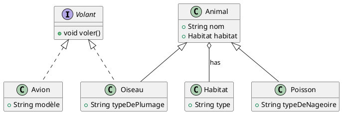
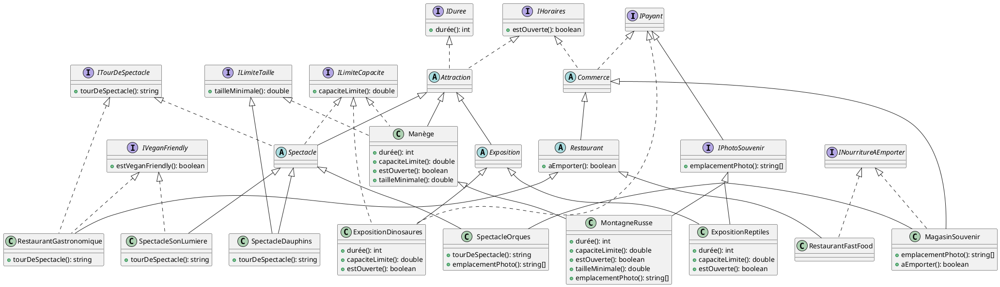

---
title: "TD Parc"
produce:
  pdf: true
  md: true
  html: true
  create_answers: true
---

> **L'énoncé est volontairement décousu et vous met en situation professionnelle dans laquelle vous n'avez qu'un compte rendu de réunion pour modéliser l'application.**
>
> **Vous allez devoir faire et défaire votre diagramme de classes en fonction des demandes "clients".**

**Instructions :**

Vous devez obligatoirement répondre à l'aide de la syntaxe PlantUML. Vous pouvez utiliser un éditeur en ligne comme (lien :[PlantText](https://www.planttext.com?text=ZLEzJiCm4Duj-Hrk2mXrOs8gKWTOe18I-pMv9YTiNx2T2eHu7_8SUJ6S9YbAMubcI9pJsT_FVLw6Y3usrcWLtjZLwD52wQMf7rr5dYEwdE1MgoWrH86Dn2WM2lQKHnQdLSK5GMum1B0KAoc2LbfbiEhQBJlkco1rc8nT9B_5TDoh67HHg-CAV6a5wRc1dN2HNeRyrRLMt-TFn06MuDwnnQHWO37y_Ptr4Zsx4fpOgVA0coGiGZL-PwWMNNaPx3C7mWRU6uQgQvDN14KsebC4jhNfMaj9v47nm73SI1-HN74WtFTJtnvEx1WbnC-QLhGsZSMIPgJp2dilBs6z5WuX5S_HdWXEFKSCp_DvIcGavM56oE659awpgANn-xBOMW8FsHhOJ2tdu6UWkEdLN1QP7OyUd8ufHO03k8n2eeK16WSuJzX-y__pib9qFsREiUZQNCmys3t2Q37swr6mLcDH5ek32NSfjViRfjKopIRTt5y0)) pour dessiner votre diagramme de classes.
Ou bien, si vous ne l'avez pas déjà fait, vous pouvez installer l'extension PlantUML pour VS Code.

Exemple : 

**Travail à faire :**

Dans cet exercice, nous allons essayer de modéliser une application, le but n'est pas de la coder, les méthodes nous importent peu, le plus important est de bien modéliser les héritages et les interfaces.

___

1. Dans notre parc d'amusement, au départ nous avons qu'un seul type d'attraction : les manèges.
Créez donc une classe abstraite Attraction puis une classe Manège qui en hérite.
2. Les montagnes russes sont un type de manège. Créez une classe MontagnesRusses qui hérite de Manège.
3. Vous avez la brillante idée d'installer des appareils photos sur les montagnes russes pour prendre des photos des visiteurs pendant le tour. Créez une interface AppareilPhoto avec une méthode prendrePhoto. Faites en sorte que MontagnesRusses implémente cette interface.
4. Les spectacles sont une autre catégorie d'attractions. Créez une classe Spectacle.
5. Vos visiteurs ont faim et ils veulent repartir avec un souvenir.
Créez une hiérarchie de classes pertinentes pour modéliser les commerces de nourriture et de souvenirs.

A partir de maintenant, les instructions seront moins guidées, immaginez vous en réunion client, il y a plein de gens qui ne connaissent rien à la programmation et qui ont des idées dans tous les sens.
Utilisez PlantUML à votre avantage pour bien modéliser tout ça, l'avantage est que si vous vous trompez, vous pourrez facilement changer votre diagramme.

- Il y a des spectacles avec des animaux
- Il y a des restaurants gastronomiques et des restaurants rapides
- Dans les restaurants gastronomiques, on ne sert pas de nourriture à emporter
- Il y a des expositions
- Il y a des boutiques de souvenirs
- Dans certaines boutiques de souvenirs, on peut acheter de la nourriture à emporter
- Il y a une taille minimale pour monter dans les manèges
- Il y a aussi une taille minimale pour le spectacle des dauphins
- Il y a une exposition sur les dinosaures et sur les reptiles
- Il y a des spectacles de dauphins et d'orques
- Pour être dans la tendance, nous avons des distractions "Vegan Friendly", ça peut être des restaurants ou des spectacles
- Il y a aussi un spectacle son et lumière (qui n'est pas un spectacle de dauphins ou d'orques et qui donc est "Vegan Friendly")
- Tous nos restaurants gastronomiques sont "Vegan Friendly"
- On peut voir des spectacles dans les attractions de type "Spectacle" mais on peut aussi voir des spectacles dans les restaurants gastronomiques
- On peut prendre des photos souvenir :
    - Dans toutes les montagnes russes
    - Dans l'expo sur les reptiles
    - Dans tous les magasins de souvenirs
    - Lors du spectacle sur les orques
- On va proposer une expérience au visiteurs d'optimisation du temps, pour cela, on aurait besoin de savoir le temps d'attente moyen pour chaque attraction et la durée de chaque attraction (donc à ce stade du TD, cela s'applique à toutes les attractions donc aussi aux Manèges et leurs dérivés, aux Spectacles et aux Expositions)
- Hum, on a oublié, il y a aussi des limites de capacités sur certaines distractions :
    - Tous les manèges
    - Tous les spectacles
    - L'expo sur les dinosaures

- C'est un peu la dèche en ce moment, on voudrait donc gagner de l'argent :
    - En vendant des photos prises dans les attractions
    - L'exposition sur les dinosaures est payante
    - Ca va de soi mais tout ce qui est vendu dans un commerce est payant (mais profitons-en puisque nous venons de créer une interface IPayant, faisons en sorte que tout ce qui est payant implémente cette interface)
- Aussi, jusqu'à présent la boutique de souvenir et les commerces ouvrent en même temps que le parc mais on aimerait bien que les attractions et les commerces aient une méthode "estOuvert"

> A titre indicatif, dans la correction il y a :
    - 9 interfaces
    - 5 classes abstraites
    - 10 classes concrètes
    **Mais ce n'est probablement pas la seule solution, il y a probablement plusieurs façons de modéliser tout ça.**

<article>

</article>
